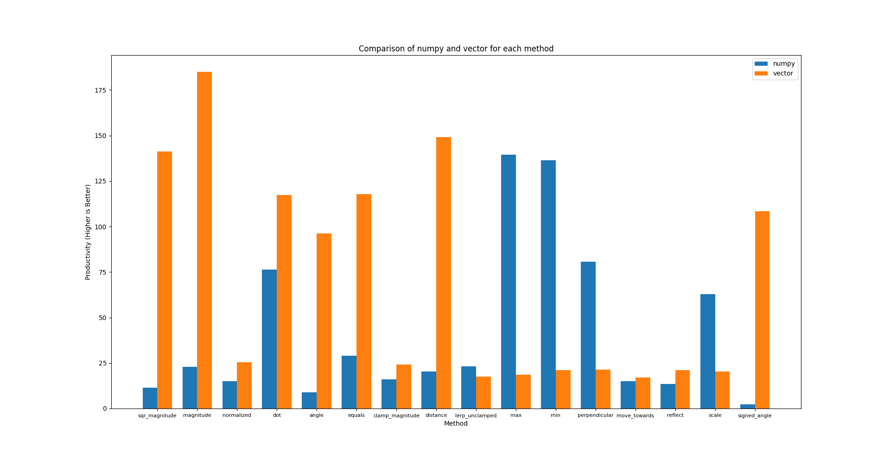

# rivector - risknu vectors
This Python library introduces a set of fast vector classes, designed for convenient and rapid vector operations, similar to those in Unity. It is well-suited for game development using Pygame and also useful for general mathematical applications. The library is open source and available on GitHub.

## How it Works and Why It's Fast
The core mathematical logic and vector class are entirely written in C++. They are then utilized through CPython in Python, transforming it into a wrapper class that can be fully utilized in Python. Speaking of its power, here are some speed-related details, including a comparison with the popular numpy library in mathematics:



```diff
+ Vector2Wrapper 0.8779744120547548
- NumPy 1.6510654900339432
```

# Methods/Functions Documentation
## Constructor
```python
from rivector import Vector2
vector = Vector2(x: float, y: float)
```
- *Parameters:*
    - `x`: The x-component of the vector.
    - `y`: The y-component of the vector.

## `set` Method
```python
vector.set(x: float, y: float)
```
- *Parameters:*
    - `new_X`: New value for the x-component.
    - `new_Y`: New value for the y-component.
> [!Note]
> Modifies the current vector.

## `equals` Method
```python
vector.equals(b: Vector2)
```
- *Parameters:*
    - `b`: Another Vector2 object for comparison.
- *Returns:* `true` if the vectors are exactly equal; otherwise, `false`.

## `clamp_magnitude` Method
```python
vector.clamp_magnitude(max_length: float)
```
- *Parameters*:
    - `max_length`: The maximum length for the vector.
- *Returns:* A dynamically allocated array representing the clamped vector.

$$
\begin{align*}
    \text{magnitude} &= \sqrt{x^2 + y^2} \\
    \text{if } \text{magnitude} &> \text{maxlength} \\
    \text{factor} &= \frac{\text{maxlength}}{\text{magnitude}} \\
    x &= x \times \text{factor} \\
    y &= y \times \text{factor}
\end{align*}
$$

## `distance` Method
```python
vector.distance(b: Vector2)
```
- *Parameters:*
    - `b`: Another Vector2 object.
- *Returns:* The distance between the two vectors.

$$
\begin{align*}
& \sqrt{(x-b.x\_coord)^{2}+(y-b.y\_coord)^{2}}
\end{align*}
$$

## `lerp_unclamped` Method
```python
vector.lerp_unclamped(a: Vector2, b: Vector2, t: float)
```
- *Parameters:*
    - `a`: Starting Vector2.
    - `b`: Ending Vector2.
    - `t`: Interpolation factor (0.0 to 1.0).
- *Returns:* A dynamically allocated array representing the interpolated vector.

$$ \begin{align*} 
    x &= a.x\_coord + (b.x\_coord - a.x\_coord) \cdot t \\
    y &= a.y\_coord + (b.y\_coord - a.y\_coord) \cdot t 
\end{align*} $$

## `max` Method
```python
vector.max(a: Vector2, b: Vector2)
```
- *Parameters:*
    - `a`: First Vector2.
    - `b`: Second Vector2.
- *Returns:* A dynamically allocated array representing the vector with the largest components.

## `min` Method
```python
vector.min(a: Vector2, b: Vector2)
```
- *Parameters:*
    - `a`: First Vector2.
    - `b`: Second Vector2.
- *Returns:* A dynamically allocated array representing the vector with the smallest components.

## `perpendicular` Method
```python
vector.perpendicular(a: Vector2)
```
- *Parameters:*
    - a: The Vector2 object.
- *Returns:* A dynamically allocated array representing the perpendicular vector.

## `move_towards` Method
```python
vector.move_towards(a: Vector2, b: Vector2, max_distance_delta: float)
```
- *Parameters:*
    - `a`: Current position.
    - `b`: Target position.
    - `max_distance_delta`: Maximum distance to move towards the target.
- *Returns:* A dynamically allocated array representing the new position.

$$
\begin{align*}
& direction = (b - a).normalize() \\
& x = a.x\_coord + direction.x * max\_distancec\_delta \\
& y = a.y\_coord + direction.y * max\_distancec\_delta
\end{align*}
$$

## `reflect` Method
```python
vector.reflect(a: Vector2, b: Vector2)
```
- *Parameters:*
    - `a`: Incident vector.
    - `b`: Normal vector.
- *Returns:* A dynamically allocated array representing the reflected vector.

$$
\begin{align*}
& parallel = (a * b) * b \\
& x = 2 * parallel.x - a.x\_coord \\
& y = 2 * parallel.y - a.y\_coord \\
\end{align*}
$$

## `scale` Method
```python
vector.scale(a: Vector2, scale: float)
```
- *Parameters:*
    - `a`: The Vector2 object.
    - `scale`: The scaling factor.
- *Returns:* A dynamically allocated array representing the scaled vector.

$$
\begin{align*}
& x = a.x\_coord * scale \\
& y = a.y\_coord * scale \\
\end{align*}
$$

## `signed_angle` Method
```python
vector.signed_angle(a: Vector2, b: Vector2)
```
- *Parameters:*
    - `a`: Starting Vector2.
    - `b`: Ending Vector2.
- *Returns:* The signed angle in degrees between the two vectors.

$$ \begin{align*} 
    \text{angle} &= \arctan2(ba, ab) \\
    \text{signedangle} &= \text{angle}
\end{align*} $$

## `smooth_damp` Method
```python
vector.smooth_damp(a: Vector2, b: Vector2, c: Vector2, smooth_time: float, max_speed: float, delta_time: float)
```
- *Parameters:*
    - `a`: Current position.
    - `b`: Target position.
    - `c`: Current velocity.
    - `smooth_time`: Smoothing time.
    - `max_speed`: Maximum speed.
    - `delta_time`: Time since the last call.
- *Returns:* A dynamically allocated array representing the smoothly interpolated position.

$$
\begin{align*}
& difference = b - 1 \\
& spring_force = difference * smooth_time * max_speed \\
& damping_force = c * 2 * \sqrt{(smooth\_time)} * sprintf\_force \\
& acceleration = (spring_force + damping_force) * delta_time \\
& x = a.x\_coord + difference.x + acceleration.x \\
& y = a.y\_coord + difference.y + acceleration.y
\end{align*}
$$

## `to_list` Method
```python
vector.to_list()
```
- *Returns:* A dynamically allocated array representing the vector.

$$
\begin{align*}
& list = \left[ x, y \right]
\end{align*}
$$

## `sqrmagnitude` Method
```python
vector.sqrmagnitude
```
- *Returns:* The squared magnitude of the vector.

$$
\begin{align*}
& sqrmagnitude = x^{2}+y^{2}
\end{align*}
$$

## `magnitude` Method
```python
vector.magnitude
```
- *Returns:* The magnitude of the vector.

$$
\begin{align*}
& magnitude = \sqrt{x^{2}+y^{2}}
\end{align*}
$$

## `normalized` Method
```python
vector.normalized()
```
- *Returns:* A dynamically allocated array representing the normalized vector.

$$
\begin{align*}
& magnitude = \sqrt{x^{2}+y^{2}} \\
& x = x/magnitude \\
& y = y/magnitude
\end{align*}
$$

## `dot` Method
```python
vector.dot(a: Vector2, b: Vector2)
```
- *Parameters:*
    - `a`: First Vector2.
    - `b`: Second Vector2.
- *Returns:* The dot product of the two vectors.

$$ \begin{align*} 
    \text{dot} &= a.x\_coord \cdot b.x\_coord + a.y\_coord \cdot b.y\_coord 
\end{align*} $$


## `angle` Method
```python
vector.angle(a: Vector2, b: Vector2)
```
- *Parameters:*
    - `a`: First Vector2.
    - `b`: Second Vector2.
- *Returns:* The angle in radians between the two vectors.

$$ \begin{align*} 
    \text{angle} &= \arccos\left(\frac{a \cdot b}{\|a\| \cdot \|b\|}\right)
\end{align*} $$


## Getter methods
```python
vector.y_coord
vector.x_coord
```
- *Returns:* The x or y component of the vector, respectively.
